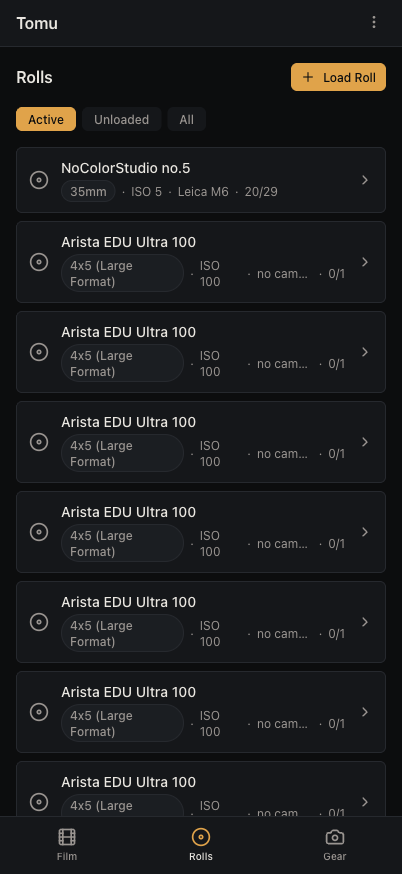
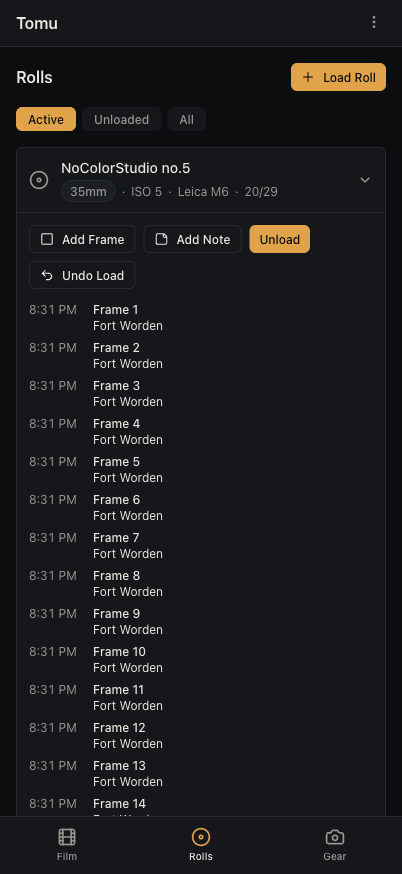
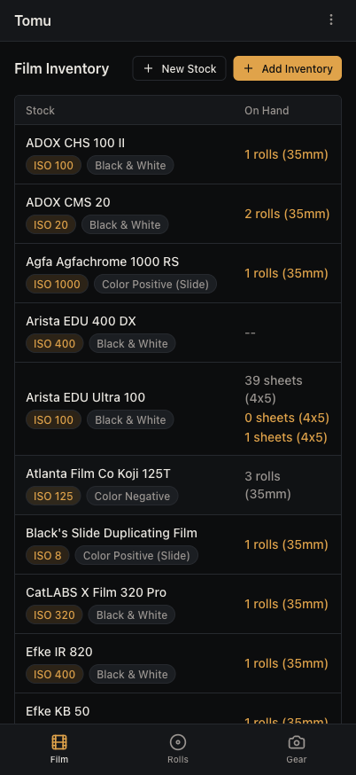
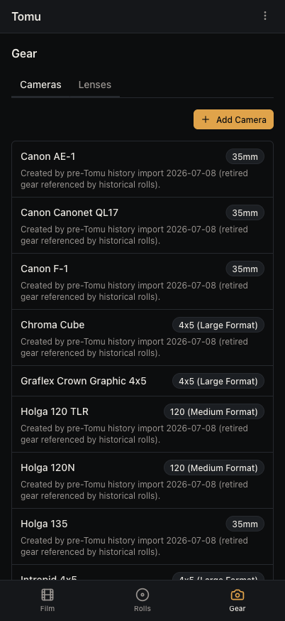

# Tomu

**Film-photography management** — track gear, film inventory, rolls, frames,
development, and scans through one pipeline: *shoot → develop → scan → catalog*.

The name is the Japanese **富む (tomu)**, "to be abundant / rich" — for the
abundance of film and photographs a working photographer accumulates.

> Status: personal project, run in production by its author. Being tidied up so
> others can self-host. **Not yet open-source-licensed** — see [License](#license).

## Screenshots

<p align="center">
  
  
  
  
</p>

<p align="center"><sub>The mobile PWA. A "darkroom" palette — one amber safelight signal, monochrome everywhere else, so a calm screen means nothing needs attention.</sub></p>

## What makes it different

- **API-first.** Every capability is a REST endpoint. The web UI is just one client.
- **Claude is a first-class client.** Tomu ships an **MCP server**, so you can log a
  roll, plan a development session, or query your history straight from a Claude
  conversation (desktop, web, or mobile) — not only from the UI.
- **A "pit of success."** Tomu tries to make the *correct* action the default one:
  identity (roll/dev/session ids) is assigned automatically at the moment the
  real-world event happens; developer dilution tables and conventions live in code,
  not your head; and it warns you before a mistake costs film.
- **Offline- and mobile-minded.** PWA client, bottom-nav, touch targets; the field
  workflow is designed around capturing now and reconciling later.

## Architecture

npm-workspaces monorepo:

| Package | What it is |
|---|---|
| `packages/shared` | TypeScript types, Zod schemas, constants. **Build first.** |
| `packages/server` | Fastify API + Drizzle ORM + PostgreSQL 16 |
| `packages/client` | React 18 + Vite + Tailwind + shadcn/ui (installable PWA) |
| `packages/mcp`    | MCP tool server (stdio for local Claude Code, HTTP for a hosted connector) |

## Quick start (local development)

Requires Node 20+ (22 LTS recommended) and PostgreSQL 16.

```bash
cp .env.example .env          # then edit DATABASE_URL etc. (see the file's comments)
npm install
npm run build:shared          # shared types must exist before server/client build
createdb filmlog              # or point DATABASE_URL at any Postgres 16
npm run -w packages/server db:push   # create the schema

npm run dev:server            # API on :3456
npm run dev:client            # client on :5173 (proxies /api -> :3456)
```

Open http://localhost:5173 and register the first account.

### Handy commands

```bash
npm run build                 # build all packages (order-aware)
npm run lint                  # eslint the client
npm run -w packages/server db:studio   # Drizzle Studio
```

## Using it from Claude (MCP)

Tomu's MCP server exposes tools like `tomu_inventory`, `tomu_rolls`,
`tomu_dev_session`, and `tomu_tank_plan`. Two ways to run it:

- **Local (Claude Code):** stdio — `node packages/mcp/dist/index.js`, configured with
  `TOMU_API_URL` + `TOMU_API_TOKEN`.
- **Hosted (any Claude client):** the HTTP transport (`packages/mcp/dist/http.js`)
  behind nginx, added as a custom connector by URL. See
  [docs/SELF-HOSTING.md](docs/SELF-HOSTING.md).

## Self-hosting & deploying

A full, reproducible walkthrough — Postgres, build, pm2, nginx + TLS, backups, and
minting the MCP token — is in **[docs/SELF-HOSTING.md](docs/SELF-HOSTING.md)**.

Once an instance exists, updates are one command:

```bash
cp .deploy.env.example .deploy.env    # set your host once
npm run deploy                        # rsync -> build -> pm2 reload
npm run deploy:migrate                # same, plus a DB schema push
```

Backups follow a portable model: nightly `pg_dump` → a private git repo, so *any*
Postgres 16 box + the latest dump rebuilds the instance in minutes. See
[RESTORE.md](RESTORE.md).

## Conventions

Project conventions (data model, IDs, developer-chemistry rules) live in
[ROADMAP.md](ROADMAP.md) and [CLAUDE.md](CLAUDE.md).

## License

**No license yet** — all rights reserved for now. A license will be chosen before any
public open-source release. Until then, please don't redistribute.
